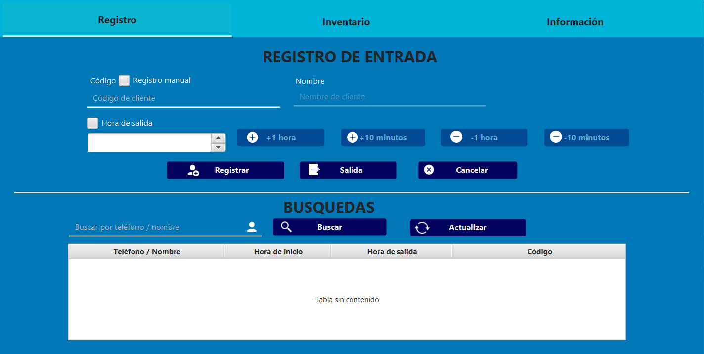
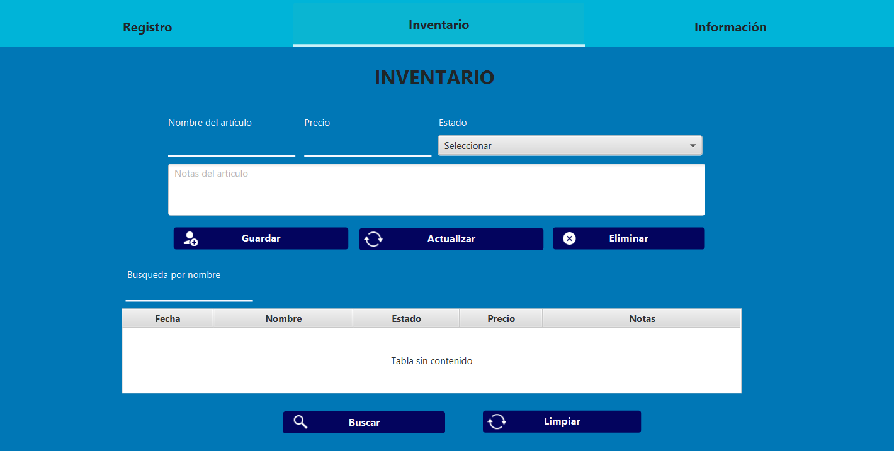
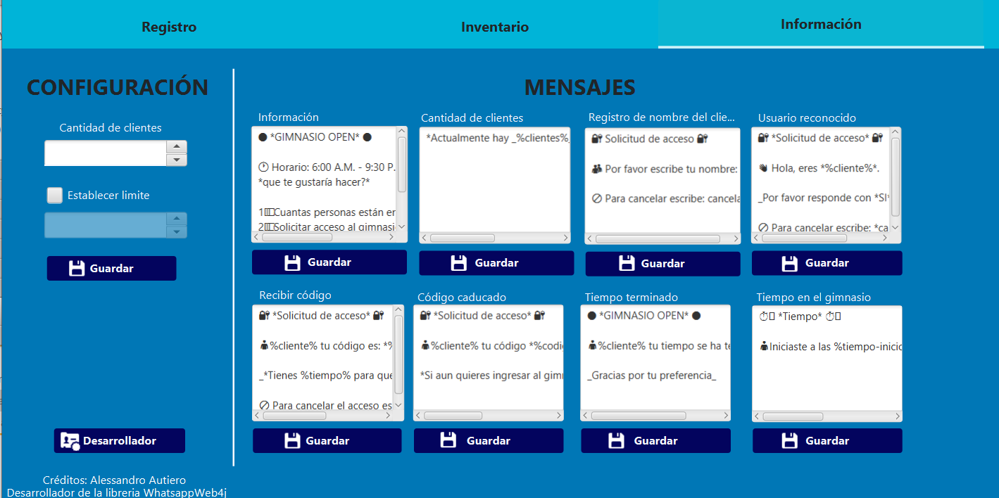

# Open Schedule
Agenda de citas por medio de WhatsApp para el control de personas en un gimnasio.

### Registro

### Inventario

### Información

# Instalacion
Es necesario construir el proyecto manualmente, puede ser clonado utilizando el siguiente comando en la terminal de git.

`git clone https://github.com/Daligz/OpenSchedule`

Al contruir el proyecto se genera un archivo ejecutable.

# Requisitos
* Java 17.
* Conexión a Internet
* Una cuenta de WhatsApp que no tenga activa la versión **beta**.

# Responsables del mantenimiento
* Daligz
* Angel Alan Gonzalez Escalona
* Arlette Jacqueline Armenta Soto
* Yoana2000
